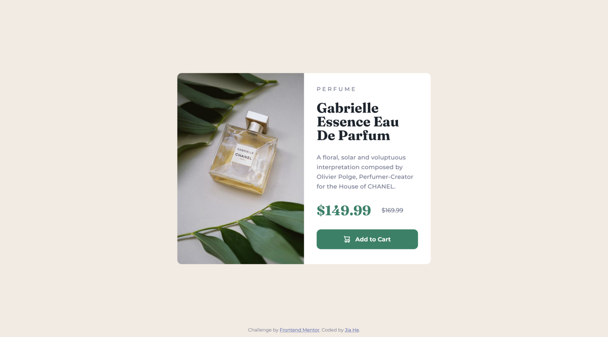

# Frontend Mentor - Product preview card component solution

This is my solution to the [Product preview card component challenge on Frontend Mentor](https://www.frontendmentor.io/challenges/product-preview-card-component-GO7UmttRfa). Frontend Mentor challenges help you improve your coding skills by building realistic projects.

## Table of contents

- [Overview](#overview)
  - [The challenge](#the-challenge)
  - [Screenshot](#screenshot)
  - [Links](#links)
- [My process](#my-process)
  - [Built with](#built-with)
  - [What I learned](#what-i-learned)
  - [Continued development](#continued-development)
  - [Useful resources](#useful-resources)
- [Author](#author)

## Overview

### The challenge

Users should be able to:

- View the optimal layout depending on their device's screen size
- See hover and focus states for interactive elements

### Screenshot

#### 📱 Mobile


#### 💻 Desktop



### Links

- Solution URL: [My solution]()
- Live Site URL: [Add live site URL here](https://product-preview-card-component-jiah.netlify.app/)

## My process

### Built with

- Semantic HTML5 markup
- CSS custom properties
- Flexbox
- CSS Grid
- Mobile-first workflow

### What I learned

While building this component, I practiced:

- Using CSS Grid to change the layout to two-column for desktop version

- Structuring CSS into multiple files to make it more readable

- Using the picture element to provide different images for responsive design.

- Using overflow: hidden to hide any part of an image that extends beyond its parent container

Here's a small snippet I'm proud of:

```html
<picture class="img-hero">
  <source
    media="(min-width: 1000px)"
    srcset="images/image-product-desktop.jpg"
  />
  
</picture>
```

```css
@media (min-width: 62.5em) {
  .card {
    display: grid;
    grid-template-columns: repeat(2, 1fr);
    max-width: 60rem;
  }
}
```

### Continued development

I'd like to learn more about layout for different screen sizes, as well as responsive images and icons.

### Useful resources

- [Responsive design - picture element](https://web.dev/learn/design/picture-element)
- [Responsive design - icons](https://web.dev/learn/design/icons)

## Author

- Frontend Mentor - [@JiaHe35354](https://www.frontendmentor.io/profile/JiaHe35354)
